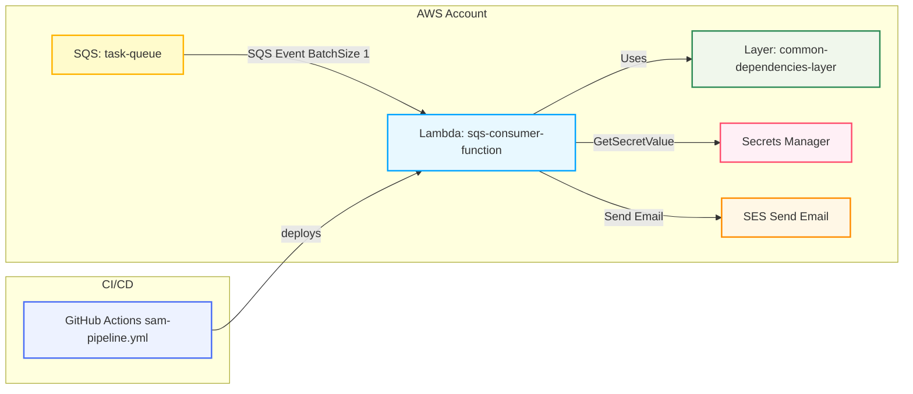

# SAM CI/CD SQS Consumer

This repository contains a Serverless Application Model (SAM) project that deploys an SQS queue, a shared Python layer, and an SQS consumer Lambda function. It also includes a GitHub Actions pipeline for CI/CD.

**Repository Layout**
- `template.yaml`: SAM template for resources and Lambda configuration.
- `src/consumer/`: Lambda function source code and its `requirements.txt`.
- `layers/common/requirements.txt`: Dependencies installed into the `common` layer.
- `.github/workflows/sam-pipeline.yml`: CI/CD workflow that validates, builds and deploys the SAM app.
- `events/sqs-event.json`: Example event for local testing.

**Quick Commands**
- Build: `sam build`
- Deploy: `sam deploy --guided` or using the included CI pipeline
- Local test (invoke with event): `sam local invoke "sqs-consumer-function" -e events/sqs-event.json`

**Notes from quick review**
- `template.yaml` defines an SQS `TaskQueue`, a `CommonLayer` (ContentUri: `layers/common/`) and `ConsumerFunction` using `consumer.app.lambda_handler`.
- Lambda has policies for SQS poller, Secrets Manager access and SES send permissions.
- Layer metadata sets `BuildMethod: python3.12` and `CompatibleRuntimes: python3.12` — these match the function runtime.
- `.github/workflows/sam-pipeline.yml` validates, lints, optionally builds the layer, and deploys via SAM; it also sends a verification message to the deployed SQS queue.

If you want, I can run the linter or SAM build locally in your environment next.

**Architecture (Mermaid)**



The diagram above renders the project components and relationships: GitHub Actions deploys the SAM stack, creating the SQS queue, layer, and Lambda function. The Lambda reads secrets from Secrets Manager and can send emails via SES.

**How to extend**
- Add more fine-grained IAM resource ARNs instead of `Resource: "*"` for Secrets Manager and SES to tighten security.
- Pin layer dependencies in `layers/common/requirements.txt` to fixed versions for reproducible builds.
- Add CloudFormation outputs for the Lambda name and Layer ARN if you want them surfaced to CI.

**Files I checked**
- [template.yaml](template.yaml)
- [src/consumer/app.py](src/consumer/app.py)
- [src/consumer/service.py](src/consumer/service.py)
- [src/consumer/secrets.py](src/consumer/secrets.py)
- [layers/common/requirements.txt](layers/common/requirements.txt)
- [.github/workflows/sam-pipeline.yml](.github/workflows/sam-pipeline.yml)

If you'd like changes (more diagram colors, different layout, or expanded architecture details), tell me which parts to emphasize and I will update the README.
# Template

This project contains source code and supporting files for a serverless application that you can deploy with the SAM CLI. It includes the following files and folders.

- consumer - Code for the application's Lambda function.
- events - Invocation events that you can use to invoke the function.
- template.yaml - A template that defines the application's AWS resources.

## Deploy the sample application

The Serverless Application Model Command Line Interface (SAM CLI) is an extension of the AWS CLI that adds functionality for building and testing Lambda applications. It uses Docker to run your functions in an Amazon Linux environment that matches Lambda. It can also emulate your application's build environment and API.

# SAM Task — SQS Consumer

This repository contains a minimal AWS SAM serverless project: an SQS queue and a consumer Lambda function that processes messages and reads secrets from AWS Secrets Manager. The stack is defined by `template.yaml` and packaged/deployed with the SAM CLI.

**Key goals**: simple SQS consumer, clear example of using a shared layer for HTTP deps, and Secrets Manager integration.

**Project layout**

- **Source:** [src/consumer/app.py](src/consumer/app.py#L1-L200) — Lambda handler (`lambda_handler`).
- **Business logic:** [src/consumer/service.py](src/consumer/service.py#L1-L200) — processing and outgoing HTTP call.
- **Secrets helper:** [src/consumer/secrets.py](src/consumer/secrets.py#L1-L200) — loads secret via Secrets Manager.
- **Layer deps:** [layers/common/requirements.txt](layers/common/requirements.txt#L1-L50) — packages included in a Lambda Layer.
- **SAM template:** [template.yaml](template.yaml#L1-L400) — defines SQS queue, layer, Lambda function, and permissions.
- **SAM config:** [samconfig.toml](samconfig.toml#L1-L200) — helpful default build/deploy settings.
- **Test event:** [events/sqs-event.json](events/sqs-event.json#L1-L200) — example SQS event for local testing.

**How it works (high level)**

- Messages are sent to the SQS queue `TaskQueue` defined in `template.yaml`.
- The `ConsumerFunction` is triggered by SQS events (batch size 10).
- `consumer.app.lambda_handler` parses each record and calls `process_message()` in `consumer.service`.
- The service loads a secret (environment variable `SECRET_NAME`) via `consumer.secrets.get_secret()` and performs an HTTP GET (example using `requests`) before returning a summary.

**Important files**

- **Handler:** [src/consumer/app.py](src/consumer/app.py#L1-L200) — iterates `event["Records"]`, parses JSON body, and forwards to `process_message()`.
- **Processing:** [src/consumer/service.py](src/consumer/service.py#L1-L200) — loads secret, prints debug info, performs `requests.get("https://httpbin.org/get")`, and returns result.
- **Secrets:** [src/consumer/secrets.py](src/consumer/secrets.py#L1-L200) — reads `SECRET_NAME` from env and fetches via `boto3.client('secretsmanager')`.

**Environment variables**

- `SECRET_NAME`: The Secrets Manager secret name (set in the template under the function's Environment variables). Locally, export `SECRET_NAME` before invoking.

**Permissions**

- The function needs permission to read Secrets Manager (`secretsmanager:GetSecretValue`). The template attaches this permission in `template.yaml`.

**Dependencies**

- Shared dependencies are packaged in `layers/common/requirements.txt` (contains `requests==2.32.3`).
- The function code itself currently has no `requirements.txt` entries in `src/consumer/requirements.txt` (file is present but empty).

**Local development & testing**

1. Install and configure SAM CLI and Docker. Ensure AWS credentials are configured if you plan to deploy.

2. (Optional) Create a virtualenv and install layer deps to a folder for local testing:

```bash
python -m venv .venv
source .venv/bin/activate
pip install -r layers/common/requirements.txt
```

3. Build with SAM (uses the layer):

```bash
sam build --use-container
```

4. Run the function locally with the example SQS event:

```bash
sam local invoke ConsumerFunction --event events/sqs-event.json
```

5. To simulate the secret locally, export a SECRET_NAME and create the secret locally (or mock `boto3`), for example:

```bash
export SECRET_NAME="local-secret"
# or set SECRET_NAME to an actual Secrets Manager value when invoking against AWS
```

**Deploying**

1. First-time deploy (guided):

```bash
sam build --use-container
sam deploy --guided
```

2. Subsequent deploys:

```bash
sam deploy
```

The `samconfig.toml` includes helpful defaults used by `sam deploy`.

**Extending the project**

- Add function-specific dependencies by populating `src/consumer/requirements.txt` and updating the build process.
- Add additional consumers or producers, or add SNS topics, DLQs, or monitoring as needed in `template.yaml`.

**Security & best practices**

- Do not commit secrets to source. Use Secrets Manager and restrict access in IAM policies to the minimal required resources.
- Consider adding a Dead-Letter Queue (DLQ) for messages that repeatedly fail processing.
- Add structured logging and error handling around external calls in `consumer.service`.

**Troubleshooting**

- If `boto3` raises credential errors locally, ensure AWS credentials are configured (`~/.aws/credentials`) or use environment variables.
- When `requests` calls fail, check network access for the environment (local containers require network access).

**Quick references**

- Handler: [src/consumer/app.py](src/consumer/app.py#L1-L200)
- Service: [src/consumer/service.py](src/consumer/service.py#L1-L200)
- Secrets helper: [src/consumer/secrets.py](src/consumer/secrets.py#L1-L200)
- Layer deps: [layers/common/requirements.txt](layers/common/requirements.txt#L1-L50)
- Template: [template.yaml](template.yaml#L1-L400)

---
